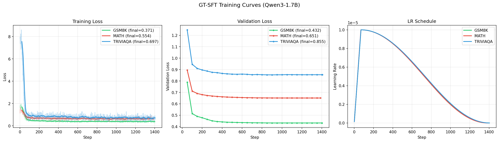
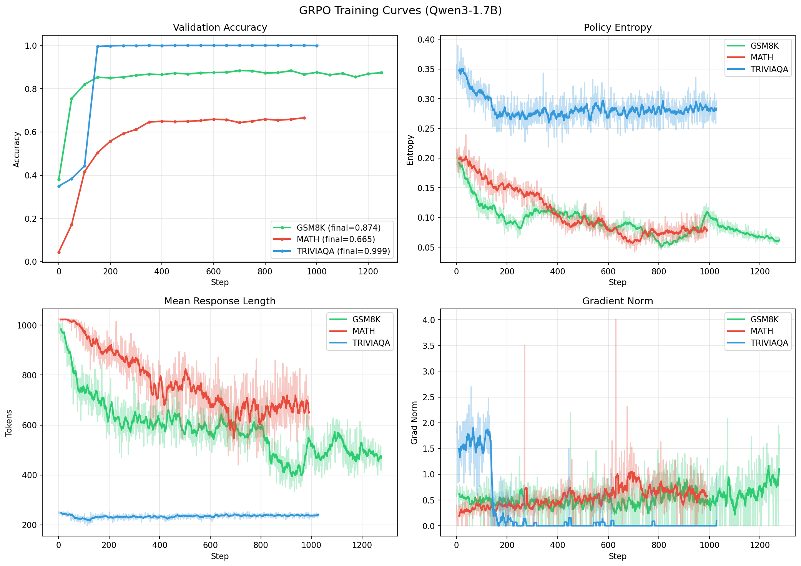
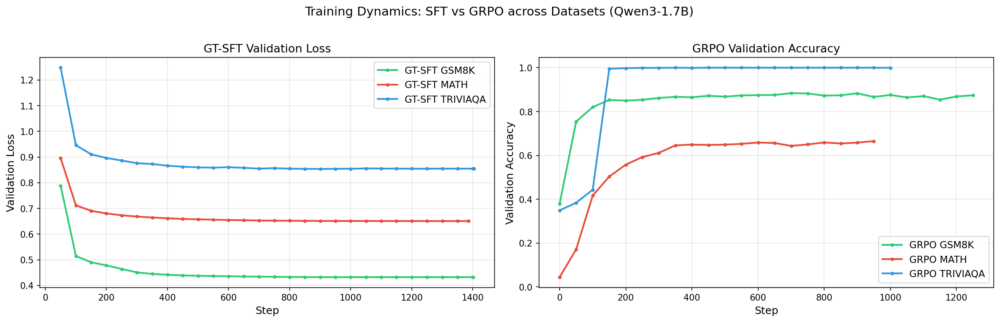
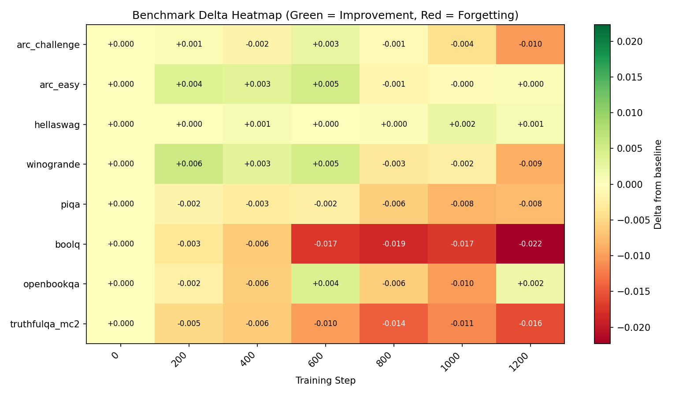
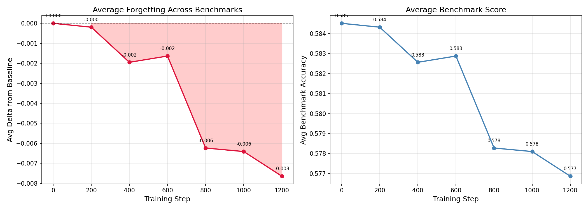
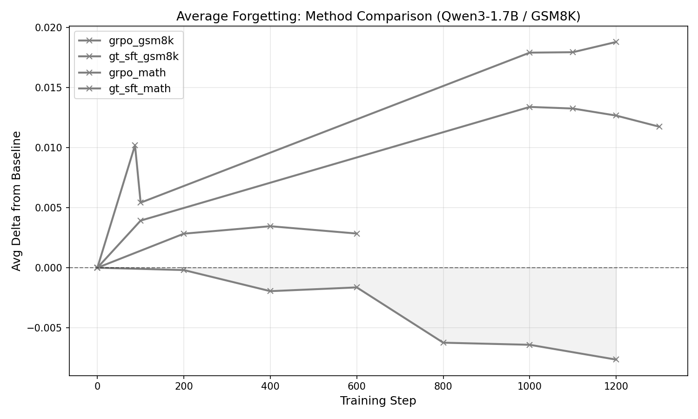
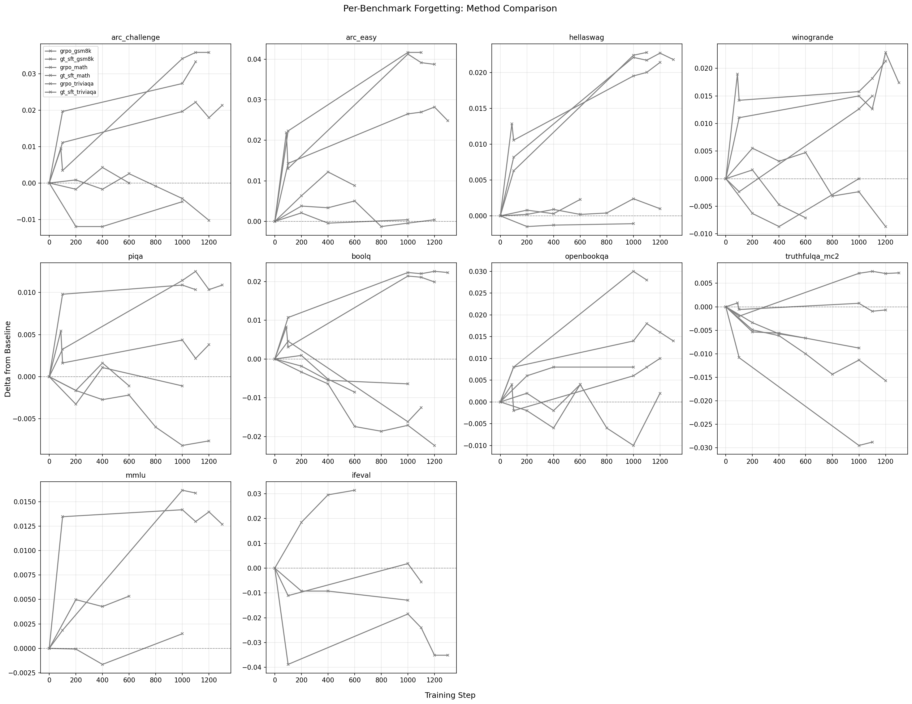
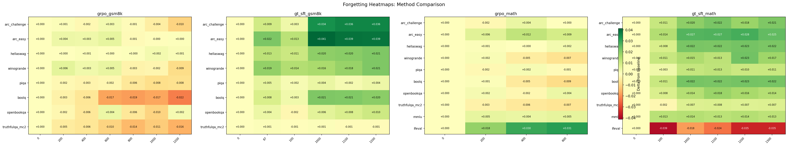

# Experiment Status Tracker

**Last updated:** 2026-03-01
**WandB:** [forgetting-llms project](https://wandb.ai/laurent-charlin/forgetting-llms)
**Repo:** [github.com/Emilianopp/forgetting-llms](https://github.com/Emilianopp/forgetting-llms)

---

## Overview

**Forgetting**: How much does a model lose on general capabilities after being fine-tuned on a specific task?

- **Train** a base model (Qwen3-1.7B) on a target task using different methods
- **Evaluate** each checkpoint on 10 **unrelated** benchmarks the model was NOT trained on
- **Compare** scores vs the base model — any drop = forgetting

### Eval Benchmarks (10)

| Benchmark | Type | Metric |
|-----------|------|--------|
| ARC-Challenge | Science QA (hard) | acc_norm |
| ARC-Easy | Science QA (easy) | acc_norm |
| HellaSwag | Commonsense NLI | acc_norm |
| WinoGrande | Coreference | acc |
| PIQA | Physical intuition | acc_norm |
| BoolQ | Yes/No QA | acc |
| OpenbookQA | Science QA + retrieval | acc_norm |
| TruthfulQA MC2 | Truthfulness | acc |
| MMLU | Broad knowledge (57 subjects) | acc |
| IFEval | Instruction following | prompt_level_strict_acc |

All 0-shot via `lm-evaluation-harness`. ~1.5h per checkpoint on 1x A100.

### Training Datasets

| Dataset | Domain | Train Size | Task |
|---------|--------|-----------|------|
| GSM8K | Math | 7,473 | Grade-school math word problems |
| MATH | Math | 7,397 | Competition math (7 subjects, EleutherAI mirror) |
| TriviaQA | QA | 7,500 | Closed-book trivia questions |

### Methods

| Method | Description | Data Source | Status |
|--------|-------------|-------------|--------|
| **GT-SFT** | SFT on ground-truth solutions | Original dataset answers | Active |
| **SF-SFT** | SFT on same-family teacher trajectories | Qwen3-32B generated solutions | Data ready |
| **GRPO** | Online RL with verifiable rewards | Model generates, reward grades | Active |
| CF-SFT | SFT on cross-family teacher trajectories | Llama-3.1-70B | Not started |
| SELF/SPIN | Self-play / self-distillation | Model's own outputs | Not started |
| PI | Policy improvement distillation | — | Not started |

---

## Training Dynamics (All Runs Complete)

### GT-SFT: Training Loss + Validation Loss + LR



### GRPO: Validation Accuracy, Entropy, Response Length, Gradient Norm



### Combined: SFT Val Loss vs GRPO Val Accuracy



**Observations:**
- **GSM8K GRPO** reaches 87% val accuracy by step 200, plateaus at ~87%
- **TriviaQA GRPO** saturates at ~100% within 200 steps — too easy for RL
- **MATH GRPO** slower climb to ~60% — harder problems
- **GT-SFT** loss converges smoothly across all 3 datasets, cosine LR schedule visible
- GRPO entropy drops sharply early (policy becoming more deterministic)

---

## Phase 1: Qwen3-1.7B

### Training Runs

| Method | Dataset | Steps | Ckpts | WandB | Checkpoints Path |
|--------|---------|-------|-------|-------|-----------------|
| GT-SFT | GSM8K | 1,401 | 15 | [run](https://wandb.ai/laurent-charlin/forgetting-llms/runs/1hjen6hx) | `checkpoints/gt_sft_qwen3_1.7b_gsm8k/` |
| GT-SFT | MATH | 1,386 | 14 | [run](https://wandb.ai/laurent-charlin/forgetting-llms/runs/9pnqos4e) | `checkpoints/gt_sft_qwen3_1.7b_math/` |
| GT-SFT | TriviaQA | 1,404 | 15 | [run](https://wandb.ai/laurent-charlin/forgetting-llms/runs/jhufx5dt) | `checkpoints/gt_sft_qwen3_1.7b_triviaqa/` |
| GRPO | GSM8K | 1,200 | 6 | [run](https://wandb.ai/laurent-charlin/forgetting-llms/runs/4mv29sme) | `checkpoints/grpo_full_qwen3_1.7b_gsm8k/` |
| GRPO | MATH | 800 | 4 | [run](https://wandb.ai/laurent-charlin/forgetting-llms/runs/dz4fzki5) | `checkpoints/grpo_qwen3_1.7b_math/` |
| GRPO | TriviaQA | 1,000 | 5 | [run](https://wandb.ai/laurent-charlin/forgetting-llms/runs/os5k8l77) | `checkpoints/grpo_qwen3_1.7b_triviaqa/` |
| SF-SFT | GSM8K | — | — | — | Training not started |
| SF-SFT | MATH | — | — | — | Training not started |
| SF-SFT | TriviaQA | — | — | — | Training not started |

All checkpoint paths relative to `~/scratch/forgetting-llms/`.

### Eval Sweeps (10 benchmarks)

| Run | Total Ckpts | Done | Status | Notes |
|-----|-------------|------|--------|-------|
| GRPO GSM8K | 6 + base | **7/7** | **COMPLETE** (8-bench) | Old run, 8 benchmarks only |
| GRPO GSM8K | 6 + base | 3/7 | QUEUED | 10-bench re-eval (job 8847627) |
| GT-SFT GSM8K | 15 + base | 4/16 | QUEUED | Resumable (job 8847628) |
| GT-SFT MATH | 14 + base | ~2/15 | RUNNING | 8840042 running, then 8847629 |
| GT-SFT TriviaQA | 15 + base | 0/16 | QUEUED | Resumable (job 8847630) |
| GRPO MATH | 4 + base | 0/5 | QUEUED | Resumable (job 8847631) |
| GRPO TriviaQA | 5 + base | 0/6 | QUEUED | Resumable (job 8847632) |
| SF-SFT GSM8K | — | — | BLOCKED | Training not started |
| SF-SFT MATH | — | — | BLOCKED | Training not started |
| SF-SFT TriviaQA | — | — | BLOCKED | Training not started |

Eval sweeps auto-resubmit on timeout via `eval_sweep_resumable.sh`.

---

## Completed Results

### GRPO GSM8K — Forgetting Analysis (8 benchmarks, steps 200–1200)

> GRPO on GSM8K causes mild but consistent forgetting across most benchmarks.






| Metric | Value |
|--------|-------|
| Avg forgetting (8 benchmarks) | **-0.0076** |
| Worst benchmark | BoolQ (-0.0223) |
| 2nd worst | TruthfulQA (-0.0157) |
| Task accuracy (step 1200) | 87.4% |

### GT-SFT GSM8K — Preliminary (old 87-step run, 8 benchmarks)

> GT-SFT on GSM8K ground truth shows **no forgetting** — slight improvement across the board.

| Metric | Value |
|--------|-------|
| Avg delta (8 benchmarks) | **+0.0102** |
| All benchmarks | Positive or neutral |

*New 15-checkpoint eval with 10 benchmarks in progress.*

### Comparison: GRPO vs GT-SFT on GSM8K (preliminary)







**Key finding:** SFT on ground truth causes no forgetting while GRPO causes mild forgetting, even though both learn the same task. This suggests the training method (not the data) drives forgetting.

---

## Data Inventory

All data in `~/scratch/forgetting-llms/data/`.

| Directory | Format | Samples | Source | Ready |
|-----------|--------|---------|--------|-------|
| `gsm8k/` | GRPO | 7,473 | openai/gsm8k | Yes |
| `gsm8k_sft/` | SFT | 7,473 | openai/gsm8k (reformatted) | Yes |
| `gsm8k_sf_sft/` | SFT | 6,946 | Qwen3-32B teacher (93% pass) | Yes |
| `math/` | GRPO | 7,397 | EleutherAI/hendrycks_math | Yes |
| `math_sft/` | SFT | 7,397 | EleutherAI/hendrycks_math | Yes |
| `math_sf_sft/` | SFT | 3,151 | Qwen3-32B teacher (43% pass) | Yes |
| `triviaqa/` | GRPO | 7,500 | mandarjoshi/trivia_qa | Yes |
| `triviaqa_sft/` | SFT | 7,500 | mandarjoshi/trivia_qa | Yes |
| `triviaqa_sf_sft/` | SFT | 6,568 | Qwen3-32B teacher (88% pass) | Yes |

---

## Cluster Notes

- **QOS limit**: ~96G total memory across running+pending jobs on `main` partition
- **Eval speed**: ~1.5h per checkpoint (10 benchmarks, batch_size=1, 1x A100)
- **Trajectory gen**: MATH ~6.5h, TriviaQA ~1.7h, GSM8K ~3.5h (Qwen3-32B, TP=2)
- **SFT training**: ~2-3h for 3 epochs (~1400 steps), 2x A100
- **GRPO training**: ~4-8h for 15 epochs, 2x A100
- Resumable evals via `eval_sweep_resumable.sh` (Slurm signal + auto-resubmit)
- Jobs chained via `--dependency=afterany` to stay within QOS

---

## TODO

- [ ] Finish 6 eval sweeps (10 benchmarks) — running now, auto-resume
- [ ] Submit SF-SFT training (3 datasets) — data ready
- [ ] Submit SF-SFT eval sweeps (3 runs)
- [ ] Regenerate comparison plots with full 10-benchmark data
- [ ] Start Phase 2: Qwen3-4B (repeat all experiments)
- [ ] CF-SFT: need Llama-3.1-70B trajectories
- [ ] SELF/SPIN: needs implementation
- [ ] PI: needs implementation

### SF-SFT Launch Commands (ready to run)

```bash
# Training (chain after eval sweeps finish to stay within QOS)
sbatch scripts/run_sft.sh gsm8k Qwen/Qwen3-1.7B sf_sft_qwen3_1.7b_gsm8k sf
sbatch scripts/run_sft.sh math Qwen/Qwen3-1.7B sf_sft_qwen3_1.7b_math sf
sbatch scripts/run_sft.sh triviaqa Qwen/Qwen3-1.7B sf_sft_qwen3_1.7b_triviaqa sf

# Eval sweeps (chain after training)
sbatch scripts/eval_sweep_resumable.sh ~/scratch/forgetting-llms/checkpoints/sf_sft_qwen3_1.7b_gsm8k sf_sft_qwen3_1.7b_gsm8k
sbatch scripts/eval_sweep_resumable.sh ~/scratch/forgetting-llms/checkpoints/sf_sft_qwen3_1.7b_math sf_sft_qwen3_1.7b_math
sbatch scripts/eval_sweep_resumable.sh ~/scratch/forgetting-llms/checkpoints/sf_sft_qwen3_1.7b_triviaqa sf_sft_qwen3_1.7b_triviaqa
```
