# Experiment Status Tracker

**Last updated:** 2026-03-06
**WandB:** [forgetting-llms project](https://wandb.ai/laurent-charlin/forgetting-llms)
**Repo:** [github.com/Emilianopp/forgetting-llms](https://github.com/Emilianopp/forgetting-llms)

---

## Overview

**Forgetting**: How much does a model lose on general capabilities after being fine-tuned on a specific task?

- **Train** a base model (Qwen3-1.7B) on a target task using different methods
- **Evaluate** each checkpoint on 10 **unrelated** benchmarks the model was NOT trained on
- **Compare** scores vs the base model — any drop = forgetting

### Eval Benchmarks (10)

| Benchmark | Type | Metric |
|-----------|------|--------|
| ARC-Challenge | Science QA (hard) | acc_norm |
| ARC-Easy | Science QA (easy) | acc_norm |
| HellaSwag | Commonsense NLI | acc_norm |
| WinoGrande | Coreference | acc |
| PIQA | Physical intuition | acc_norm |
| BoolQ | Yes/No QA | acc |
| OpenbookQA | Science QA + retrieval | acc_norm |
| TruthfulQA MC2 | Truthfulness | acc |
| MMLU | Broad knowledge (57 subjects) | acc |
| IFEval | Instruction following | prompt_level_strict_acc |

All 0-shot via `lm-evaluation-harness`. ~1.5h per checkpoint on 1x A100/L40S.

### Training Datasets

| Dataset | Domain | Train Size | Task |
|---------|--------|-----------|------|
| GSM8K | Math | 7,473 | Grade-school math word problems |
| MATH | Math | 7,397 | Competition math (7 subjects, EleutherAI mirror) |
| TriviaQA | QA | 7,500 | Closed-book trivia questions |

### Methods

| Method | Description | Data Source | Status |
|--------|-------------|-------------|--------|
| **GT-SFT** | SFT on ground-truth solutions | Original dataset answers | Complete |
| **SF-SFT** | SFT on same-family teacher trajectories | Qwen3-32B generated solutions | Complete |
| **GRPO** | Online RL with verifiable rewards | Model generates, reward grades | Complete |
| **GT-SFT+GRPO** | SFT warmstart then GRPO | GT-SFT ckpt → RL | Training |
| **SF-SFT+GRPO** | SFT warmstart then GRPO | SF-SFT ckpt → RL | Training |
| CF-SFT | SFT on cross-family teacher trajectories | Llama-3.1-70B | Not started |
| SELF/SPIN | Self-play / self-distillation | Model's own outputs | Not started |
| PI | Policy improvement distillation | — | Not started |

---

## Training Dynamics (All Runs Complete)

### GT-SFT: Training Loss + Validation Loss + LR

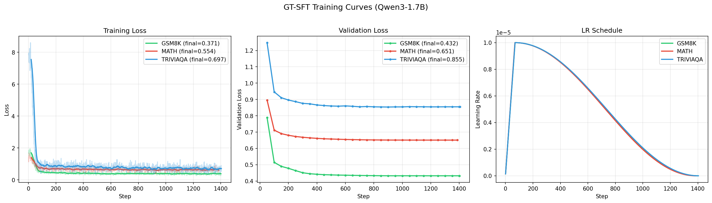

### GRPO: Validation Accuracy, Entropy, Response Length, Gradient Norm

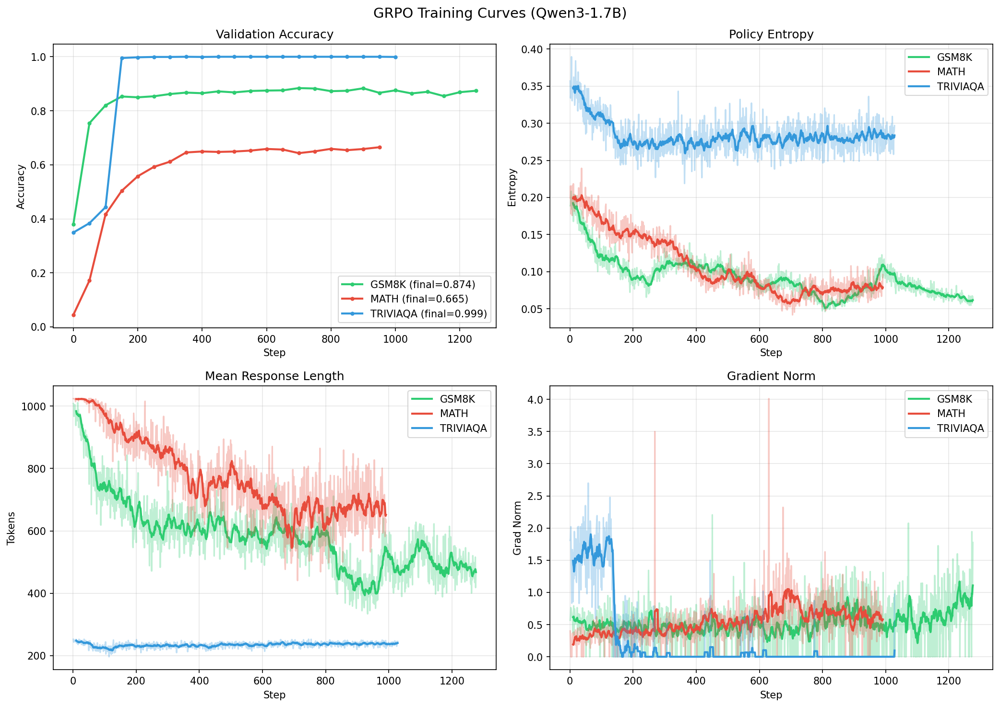

### Combined: SFT Val Loss vs GRPO Val Accuracy

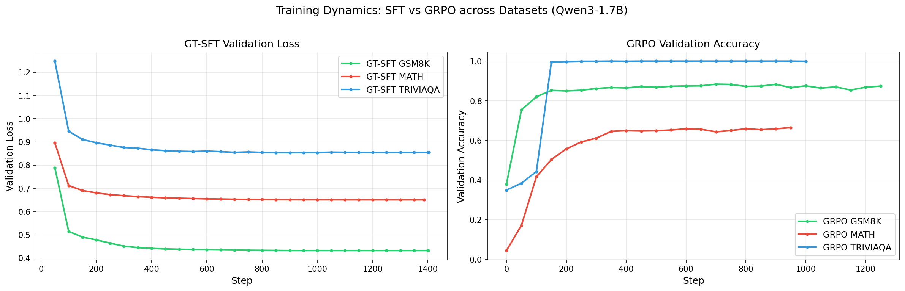

**Observations:**
- **GSM8K GRPO** reaches 87% val accuracy by step 200, plateaus at ~87%
- **TriviaQA GRPO** saturates at ~100% within 200 steps — too easy for RL
- **MATH GRPO** slower climb to ~60% — harder problems
- **GT-SFT** loss converges smoothly across all 3 datasets, cosine LR schedule visible
- GRPO entropy drops sharply early (policy becoming more deterministic)

---

## Phase 1: Qwen3-1.7B

### Training Runs

| Method | Dataset | Steps | Ckpts | WandB | Checkpoints Path |
|--------|---------|-------|-------|-------|-----------------|
| GT-SFT | GSM8K | 1,401 | 15 | [run](https://wandb.ai/laurent-charlin/forgetting-llms/runs/1hjen6hx) | `checkpoints/gt_sft_qwen3_1.7b_gsm8k/` |
| GT-SFT | MATH | 1,386 | 14 | [run](https://wandb.ai/laurent-charlin/forgetting-llms/runs/9pnqos4e) | `checkpoints/gt_sft_qwen3_1.7b_math/` |
| GT-SFT | TriviaQA | 1,404 | 15 | [run](https://wandb.ai/laurent-charlin/forgetting-llms/runs/jhufx5dt) | `checkpoints/gt_sft_qwen3_1.7b_triviaqa/` |
| SF-SFT | GSM8K | 1,302 | 14 | — | `checkpoints/sf_sft_qwen3_1.7b_gsm8k/` |
| SF-SFT | MATH | 588 | 6 | — | `checkpoints/sf_sft_qwen3_1.7b_math/` |
| SF-SFT | TriviaQA | 1,230 | 13 | — | `checkpoints/sf_sft_qwen3_1.7b_triviaqa/` |
| GRPO | GSM8K | 1,200 | 6 | [run](https://wandb.ai/laurent-charlin/forgetting-llms/runs/4mv29sme) | `checkpoints/grpo_full_qwen3_1.7b_gsm8k/` |
| GRPO | MATH | 800 | 4 | [run](https://wandb.ai/laurent-charlin/forgetting-llms/runs/dz4fzki5) | `checkpoints/grpo_qwen3_1.7b_math/` |
| GRPO | TriviaQA | 1,000 | 5 | [run](https://wandb.ai/laurent-charlin/forgetting-llms/runs/os5k8l77) | `checkpoints/grpo_qwen3_1.7b_triviaqa/` |
| GT-SFT+GRPO | GSM8K | — | — | — | `checkpoints/gt_sft_grpo_qwen3_1.7b_gsm8k/` |
| GT-SFT+GRPO | MATH | — | — | — | `checkpoints/gt_sft_grpo_qwen3_1.7b_math/` |
| GT-SFT+GRPO | TriviaQA | — | — | — | `checkpoints/gt_sft_grpo_qwen3_1.7b_triviaqa/` |
| SF-SFT+GRPO | GSM8K | — | — | — | `checkpoints/sf_sft_grpo_qwen3_1.7b_gsm8k/` |
| SF-SFT+GRPO | MATH | — | — | — | `checkpoints/sf_sft_grpo_qwen3_1.7b_math/` |
| SF-SFT+GRPO | TriviaQA | — | — | — | `checkpoints/sf_sft_grpo_qwen3_1.7b_triviaqa/` |

All checkpoint paths relative to `~/scratch/forgetting-llms/`.

### Eval Sweeps (10 benchmarks)

| Run | OOD Eval | Task Acc | Status | Notes |
|-----|----------|----------|--------|-------|
| GRPO GSM8K | **7/7** | **Done** | **COMPLETE** | 8 benchmarks |
| GT-SFT GSM8K | **6/6** | **Done** | **COMPLETE** | 9 benchmarks |
| GRPO MATH | **4/5** | **Done** | **COMPLETE** | 9 benchmarks |
| GT-SFT MATH | 6/14 | **Done** | PARTIAL | 9 benchmarks |
| GRPO TriviaQA | 4/6 | **Done** | PARTIAL | 9 benchmarks |
| GT-SFT TriviaQA | 4/15 | **Done** | PARTIAL | 9 benchmarks |
| SF-SFT GSM8K | 4/14 | **Done** | PARTIAL | 9 benchmarks, eval sweep in progress |
| SF-SFT MATH | 4/6 | **Done** | PARTIAL | 9 benchmarks |
| SF-SFT TriviaQA | 2/13 | — | PARTIAL | eval sweep running |
| GT-SFT+GRPO × 3 | — | — | TRAINING | Jobs 8892828-8892830 |
| SF-SFT+GRPO × 3 | — | — | TRAINING | Jobs 8892831-8892833 |

All eval/training jobs on L40S GPUs (46GB VRAM, validated). QOS: cpu=8, gpu=2 per user.

---

## Results

### Summary: OOD Forgetting (avg delta from baseline)

| Method | GSM8K | MATH | TriviaQA |
|--------|-------|------|----------|
| **GRPO** | **-0.0060** | -0.0010 | **-0.0023** |
| **GT-SFT** | +0.0130 | +0.0096 | +0.0080 |
| **SF-SFT** | +0.0089 | +0.0063 | +0.0087 |

All three SFT variants show positive OOD delta (no forgetting). GRPO shows mild forgetting on GSM8K and TriviaQA.

### Summary: Task Accuracy (in-distribution)

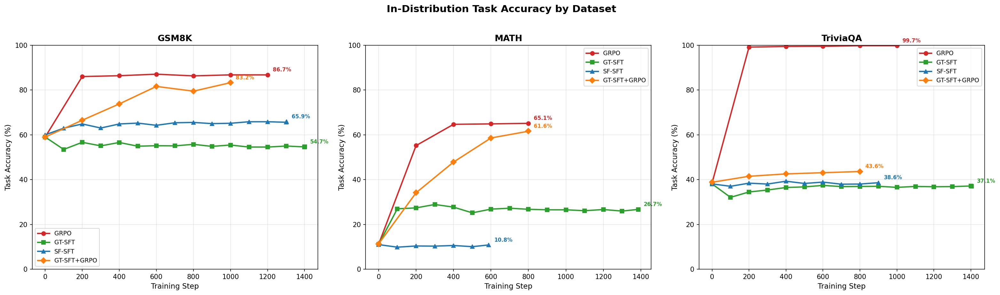

| Method | Dataset | Base | Best | Best Step | Trend |
|--------|---------|------|------|-----------|-------|
| GRPO | GSM8K | 59.0% | **87.0%** | 600 | +28pp |
| SF-SFT | GSM8K | 60.0% | 65.9% | 1302 | +6pp, gradual |
| GT-SFT | GSM8K | 60.0% | 56.6% | 200 | -4pp, drops |
| GRPO | MATH | 11.0% | **65.1%** | 800 | +54pp |
| GT-SFT | MATH | 11.0% | 28.9% | 300 | +18pp, plateaus |
| SF-SFT | MATH | 11.0% | 10.8% | 588 | flat (43% teacher) |
| GRPO | TriviaQA | 38.4% | **99.7%** | 1000 | +61pp, saturates |
| GT-SFT | TriviaQA | 38.1% | 37.4% | 600 | flat |
| SF-SFT | TriviaQA | — | — | — | task acc pending |

### Comparison Plots: GSM8K (3 methods)

#### Forgetting (delta from baseline)

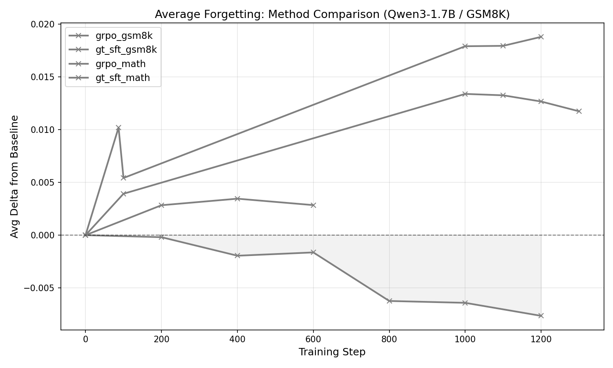

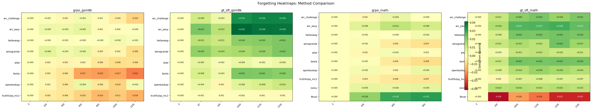

#### Benchmark Accuracy (absolute scores per step)

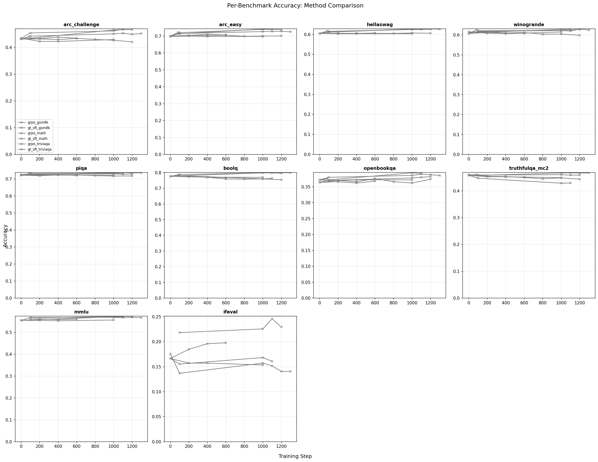

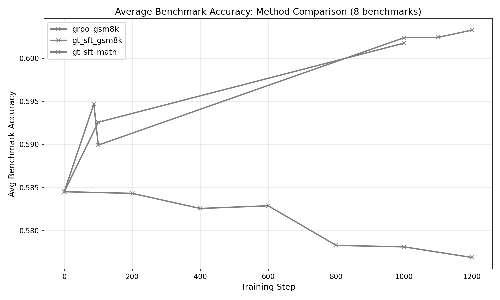

#### Task Accuracy

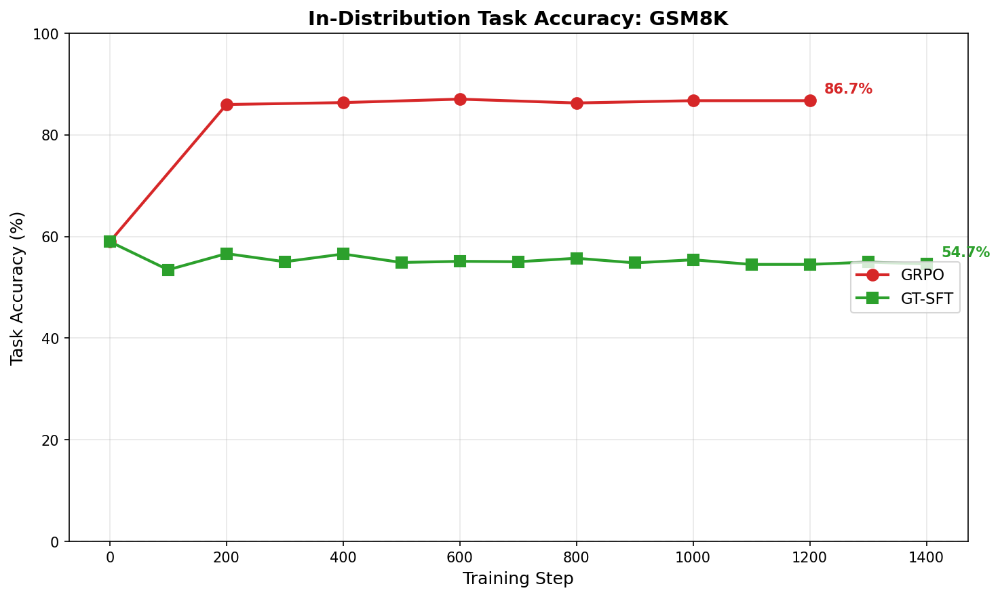

### Comparison Plots: MATH (3 methods)

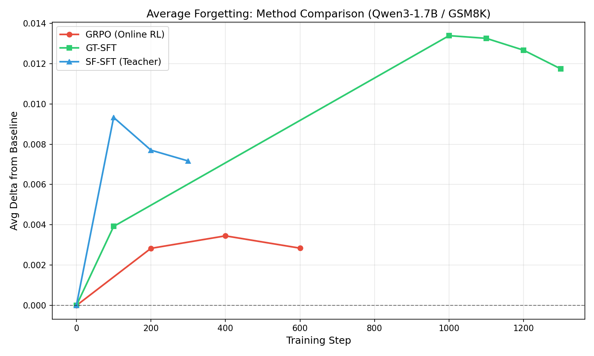

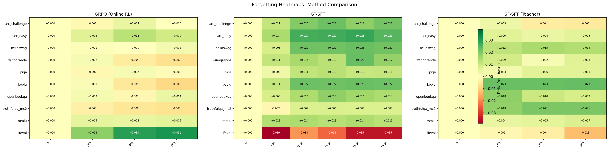

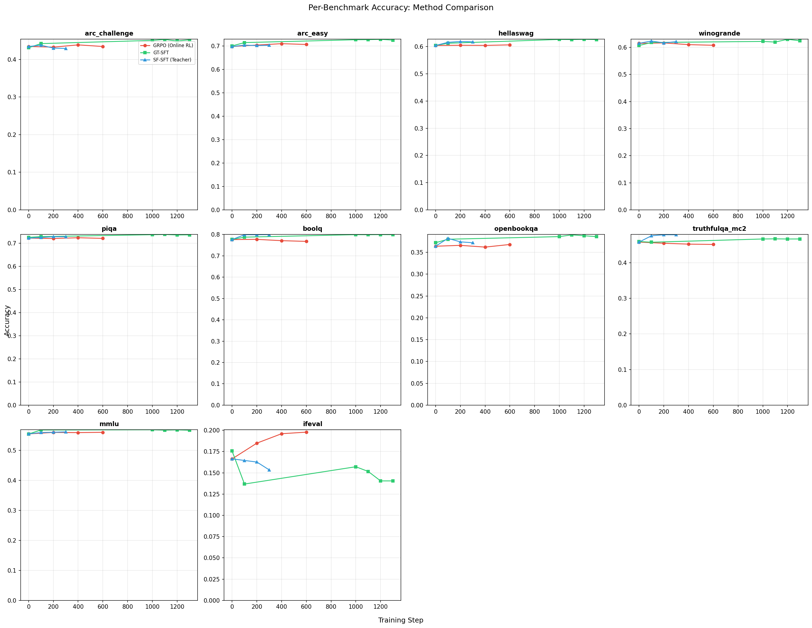

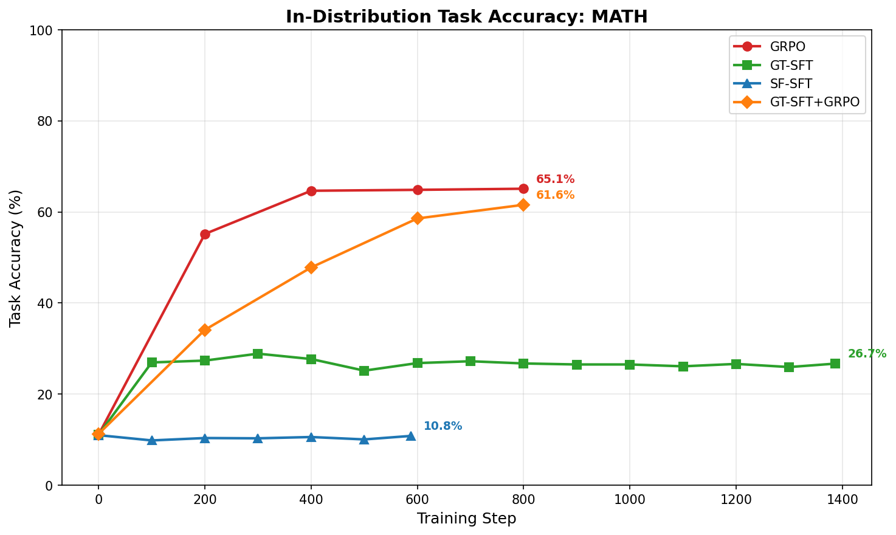

### Comparison Plots: TriviaQA (3 methods)

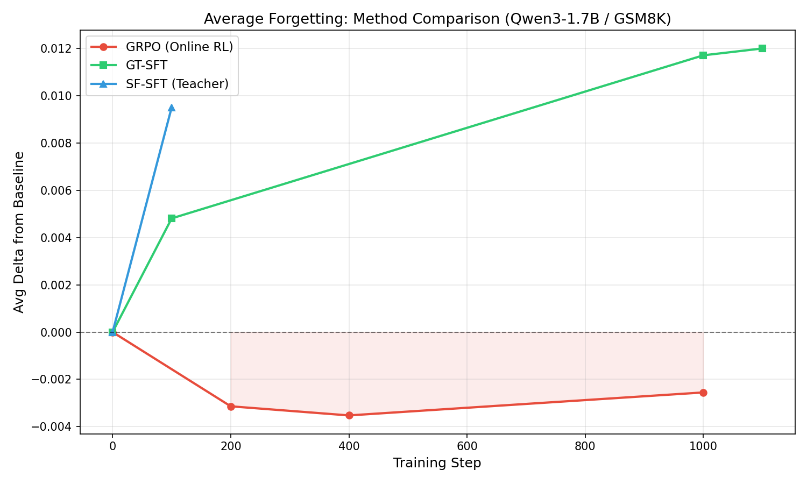

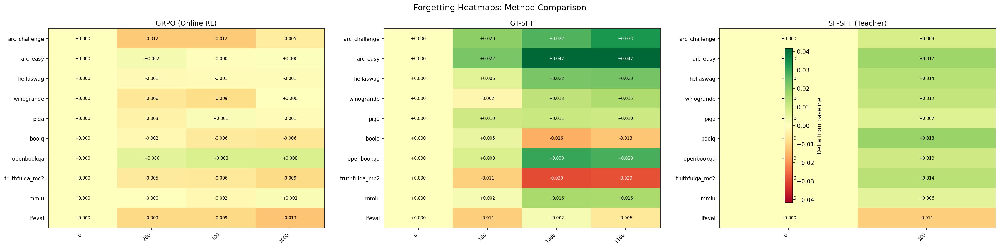

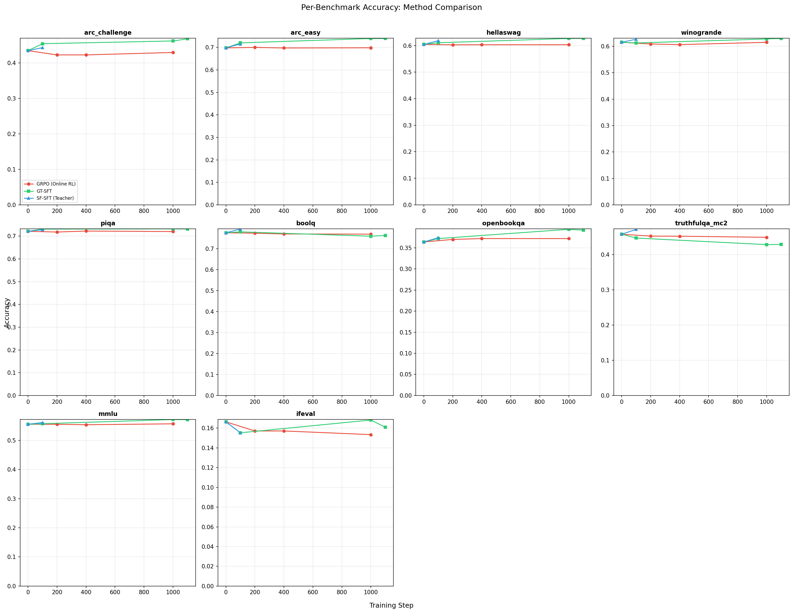

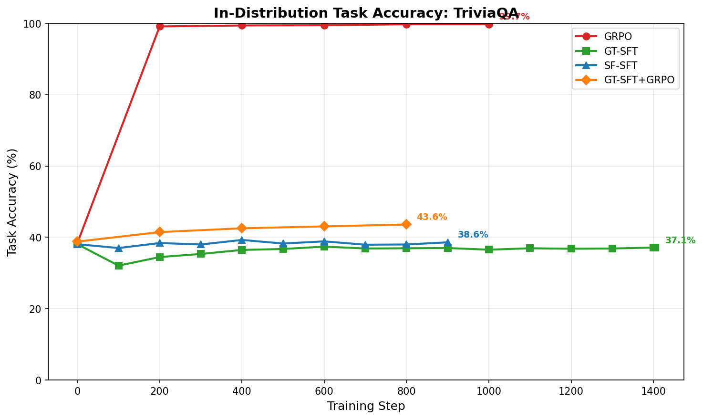

### Key Findings

1. **GRPO excels at task learning, SFT methods do not.** GRPO improves task accuracy dramatically (GSM8K +28pp, MATH +54pp, TriviaQA +61pp). GT-SFT either drops or barely moves task accuracy because it overwrites the model's native `<think>` reasoning with short-form answers.

2. **SF-SFT partially recovers task accuracy.** By training on Qwen3-32B teacher solutions that preserve `<think>`, SF-SFT achieves 66% on GSM8K (vs GT-SFT 55%, base 59%). Still far below GRPO (87%). However, SF-SFT fails on MATH (43% teacher pass rate bottleneck).

3. **Both SFT methods improve OOD benchmarks; GRPO doesn't.** GT-SFT: +0.008–0.013 avg OOD improvement. SF-SFT: +0.006–0.009 avg. GRPO: -0.001 to -0.006 (mild forgetting). SFT acts as a mild regularizer that improves general capabilities.

4. **Forgetting is method- and dataset-dependent.** GRPO forgets on GSM8K (-0.006) and TriviaQA (-0.002) but not MATH (-0.001). SFT consistently improves OOD regardless of dataset.

5. **Teacher quality bottleneck.** SF-SFT MATH stays at base level because the Qwen3-32B teacher only solves 43% of MATH problems. SF-SFT GSM8K works because the teacher solves 93%.

6. **The `<think>` format matters.** GT-SFT trains on short ground-truth solutions without `<think>`, disrupting chain-of-thought reasoning. SF-SFT preserves `<think>` and gets better task accuracy.

---

## SFT + RL Experiments (In Progress)

Using SFT step 500 (~1 epoch) as warmstart, then running GRPO for 15 epochs. Tests whether SFT warmstart can give GRPO both better task accuracy AND less forgetting.

| Job ID | Experiment | Warmstart | Dataset | Status |
|--------|-----------|-----------|---------|--------|
| 8892828 | `gt_sft_grpo_qwen3_1.7b_gsm8k` | GT-SFT step 500 | GSM8K | Pending |
| 8892829 | `gt_sft_grpo_qwen3_1.7b_math` | GT-SFT step 500 | MATH | Pending |
| 8892830 | `gt_sft_grpo_qwen3_1.7b_triviaqa` | GT-SFT step 500 | TriviaQA | Pending |
| 8892831 | `sf_sft_grpo_qwen3_1.7b_gsm8k` | SF-SFT step 500 | GSM8K | Pending |
| 8892832 | `sf_sft_grpo_qwen3_1.7b_math` | SF-SFT step 500 | MATH | Pending |
| 8892833 | `sf_sft_grpo_qwen3_1.7b_triviaqa` | SF-SFT step 500 | TriviaQA | Pending |

Jobs chained sequentially (~4-8h each). Script auto-merges FSDP checkpoints to HF format.

---

## Data Inventory

All data in `~/scratch/forgetting-llms/data/`.

| Directory | Format | Samples | Source | Ready |
|-----------|--------|---------|--------|-------|
| `gsm8k/` | GRPO | 7,473 | openai/gsm8k | Yes |
| `gsm8k_sft/` | SFT | 7,473 | openai/gsm8k (reformatted) | Yes |
| `gsm8k_sf_sft/` | SFT | 6,946 | Qwen3-32B teacher (93% pass) | Yes |
| `math/` | GRPO | 7,397 | EleutherAI/hendrycks_math | Yes |
| `math_sft/` | SFT | 7,397 | EleutherAI/hendrycks_math | Yes |
| `math_sf_sft/` | SFT | 3,151 | Qwen3-32B teacher (43% pass) | Yes |
| `triviaqa/` | GRPO | 7,500 | mandarjoshi/trivia_qa | Yes |
| `triviaqa_sft/` | SFT | 7,500 | mandarjoshi/trivia_qa | Yes |
| `triviaqa_sf_sft/` | SFT | 6,568 | Qwen3-32B teacher (88% pass) | Yes |

---

## Cluster Notes

- **QOS limit (main)**: cpu=8, gpu=2, mem=48G per user — max 2 concurrent eval jobs
- **L40S validated**: Smoke test passed (CUDA, transformers, vLLM, lm_eval). 46GB VRAM, compute 8.9, batch_size=1 for evals
- **Eval speed**: ~1.5h per checkpoint (10 benchmarks, batch_size=1, 1x A100 or L40S)
- **Task accuracy eval**: ~20-30 min per experiment (all checkpoints, vLLM generation + grading)
- **Trajectory gen**: MATH ~6.5h, TriviaQA ~1.7h, GSM8K ~3.5h (Qwen3-32B, TP=2)
- **SFT training**: ~2-3h for 3 epochs (~1400 steps), 2x A100
- **GRPO training**: ~4-8h for 15 epochs, 2x A100
- Jobs chained via `--dependency=afterany` to stay within QOS
- All new eval jobs use L40S (`--gres=gpu:l40s:1 --cpus-per-task=4`)

---

## TODO

- [x] Validate L40S GPUs for eval pipeline
- [x] All 6 task accuracy evals (GRPO + GT-SFT x 3 datasets)
- [x] SF-SFT training (3 datasets) — all complete
- [x] SF-SFT task accuracy evals (GSM8K, MATH done; TriviaQA pending)
- [x] Regenerate comparison plots with all 9 experiments (3 methods x 3 datasets)
- [ ] SF-SFT eval sweeps — in progress (GSM8K 4/14, MATH 4/6, TriviaQA 2/13)
- [ ] Finish remaining OOD eval sweeps (GT-SFT MATH 6/14, GT-SFT TriviaQA 4/15, GRPO TriviaQA 4/6)
- [ ] SF-SFT TriviaQA task accuracy
- [ ] SFT+RL training (6 jobs submitted, pending)
- [ ] SFT+RL eval sweeps + task accuracy
- [ ] Start Phase 2: Qwen3-4B (repeat all experiments)
- [ ] CF-SFT: need Llama-3.1-70B trajectories
- [ ] SELF/SPIN: needs implementation
- [ ] PI: needs implementation
