# Experiment Status Tracker

**Last updated:** 2026-03-03
**WandB:** [forgetting-llms project](https://wandb.ai/laurent-charlin/forgetting-llms)
**Repo:** [github.com/Emilianopp/forgetting-llms](https://github.com/Emilianopp/forgetting-llms)

---

## Overview

**Forgetting**: How much does a model lose on general capabilities after being fine-tuned on a specific task?

- **Train** a base model (Qwen3-1.7B) on a target task using different methods
- **Evaluate** each checkpoint on 10 **unrelated** benchmarks the model was NOT trained on
- **Compare** scores vs the base model — any drop = forgetting

### Eval Benchmarks (10)

| Benchmark | Type | Metric |
|-----------|------|--------|
| ARC-Challenge | Science QA (hard) | acc_norm |
| ARC-Easy | Science QA (easy) | acc_norm |
| HellaSwag | Commonsense NLI | acc_norm |
| WinoGrande | Coreference | acc |
| PIQA | Physical intuition | acc_norm |
| BoolQ | Yes/No QA | acc |
| OpenbookQA | Science QA + retrieval | acc_norm |
| TruthfulQA MC2 | Truthfulness | acc |
| MMLU | Broad knowledge (57 subjects) | acc |
| IFEval | Instruction following | prompt_level_strict_acc |

All 0-shot via `lm-evaluation-harness`. ~1.5h per checkpoint on 1x A100/L40S.

### Training Datasets

| Dataset | Domain | Train Size | Task |
|---------|--------|-----------|------|
| GSM8K | Math | 7,473 | Grade-school math word problems |
| MATH | Math | 7,397 | Competition math (7 subjects, EleutherAI mirror) |
| TriviaQA | QA | 7,500 | Closed-book trivia questions |

### Methods

| Method | Description | Data Source | Status |
|--------|-------------|-------------|--------|
| **GT-SFT** | SFT on ground-truth solutions | Original dataset answers | Active |
| **SF-SFT** | SFT on same-family teacher trajectories | Qwen3-32B generated solutions | Data ready |
| **GRPO** | Online RL with verifiable rewards | Model generates, reward grades | Active |
| CF-SFT | SFT on cross-family teacher trajectories | Llama-3.1-70B | Not started |
| SELF/SPIN | Self-play / self-distillation | Model's own outputs | Not started |
| PI | Policy improvement distillation | — | Not started |

---

## Training Dynamics (All Runs Complete)

### GT-SFT: Training Loss + Validation Loss + LR


### GRPO: Validation Accuracy, Entropy, Response Length, Gradient Norm


### Combined: SFT Val Loss vs GRPO Val Accuracy


**Observations:**
- **GSM8K GRPO** reaches 87% val accuracy by step 200, plateaus at ~87%
- **TriviaQA GRPO** saturates at ~100% within 200 steps — too easy for RL
- **MATH GRPO** slower climb to ~60% — harder problems
- **GT-SFT** loss converges smoothly across all 3 datasets, cosine LR schedule visible
- GRPO entropy drops sharply early (policy becoming more deterministic)

---

## Phase 1: Qwen3-1.7B

### Training Runs

| Method | Dataset | Steps | Ckpts | WandB | Checkpoints Path |
|--------|---------|-------|-------|-------|-----------------|
| GT-SFT | GSM8K | 1,401 | 15 | [run](https://wandb.ai/laurent-charlin/forgetting-llms/runs/1hjen6hx) | `checkpoints/gt_sft_qwen3_1.7b_gsm8k/` |
| GT-SFT | MATH | 1,386 | 14 | [run](https://wandb.ai/laurent-charlin/forgetting-llms/runs/9pnqos4e) | `checkpoints/gt_sft_qwen3_1.7b_math/` |
| GT-SFT | TriviaQA | 1,404 | 15 | [run](https://wandb.ai/laurent-charlin/forgetting-llms/runs/jhufx5dt) | `checkpoints/gt_sft_qwen3_1.7b_triviaqa/` |
| GRPO | GSM8K | 1,200 | 6 | [run](https://wandb.ai/laurent-charlin/forgetting-llms/runs/4mv29sme) | `checkpoints/grpo_full_qwen3_1.7b_gsm8k/` |
| GRPO | MATH | 800 | 4 | [run](https://wandb.ai/laurent-charlin/forgetting-llms/runs/dz4fzki5) | `checkpoints/grpo_qwen3_1.7b_math/` |
| GRPO | TriviaQA | 1,000 | 5 | [run](https://wandb.ai/laurent-charlin/forgetting-llms/runs/os5k8l77) | `checkpoints/grpo_qwen3_1.7b_triviaqa/` |
| SF-SFT | GSM8K | — | — | — | Training not started |
| SF-SFT | MATH | — | — | — | Training not started |
| SF-SFT | TriviaQA | — | — | — | Training not started |

All checkpoint paths relative to `~/scratch/forgetting-llms/`.

### Eval Sweeps (10 benchmarks)

| Run | Total Ckpts | Done | Status | GPU | Notes |
|-----|-------------|------|--------|-----|-------|
| GRPO GSM8K | 6 + base | **7/7** | **COMPLETE** | A100 | 10 benchmarks |
| GT-SFT GSM8K | 6 + base | **6/6** | **COMPLETE** | A100 | 8 benchmarks (steps 0, 87, 100, 1000–1200) |
| GT-SFT MATH | 14 + base | 3/15 | **RUNNING** | L40S | Job 8864513 on cn-l037 |
| GRPO MATH | 4 + base | 1/5 | **RUNNING** | L40S | Job 8864514 on cn-l054 |
| GT-SFT TriviaQA | 15 + base | 0/16 | QUEUED | L40S | Job 8864515, depends on GT-SFT MATH |
| GRPO TriviaQA | 5 + base | 0/6 | QUEUED | L40S | Job 8864516, depends on GRPO MATH |
| SF-SFT GSM8K | — | — | BLOCKED | — | Training not started |
| SF-SFT MATH | — | — | BLOCKED | — | Training not started |
| SF-SFT TriviaQA | — | — | BLOCKED | — | Training not started |

**Task Accuracy Evals** (in-distribution, via vLLM + unified_reward.py):

| Run | Status | Notes |
|-----|--------|-------|
| GRPO GSM8K | **COMPLETE** | Base: 59.0% → Step 1200: 86.7% |
| GT-SFT GSM8K | **COMPLETE** | Base: 59.0% → Step 1401: 54.7% (drops!) |
| GT-SFT MATH | QUEUED | Job 8864517 |
| GRPO MATH | QUEUED | Job 8864518 |
| GT-SFT TriviaQA | QUEUED | Job 8864519 |
| GRPO TriviaQA | QUEUED | Job 8864520 |

All new jobs on L40S GPUs (46GB VRAM, validated). 2 jobs run in parallel (QOS: 8 CPU, 2 GPU limit).

---

## Results

### GRPO GSM8K — Forgetting (8 benchmarks, complete; 10 benchmarks, partial)

> GRPO on GSM8K causes mild but consistent forgetting across most benchmarks.

**8-benchmark results (complete, steps 200–1200):**

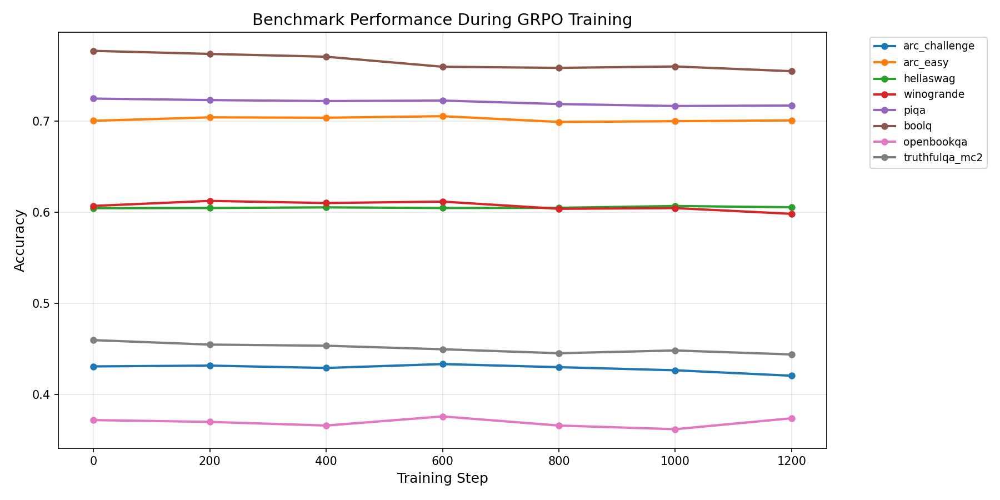

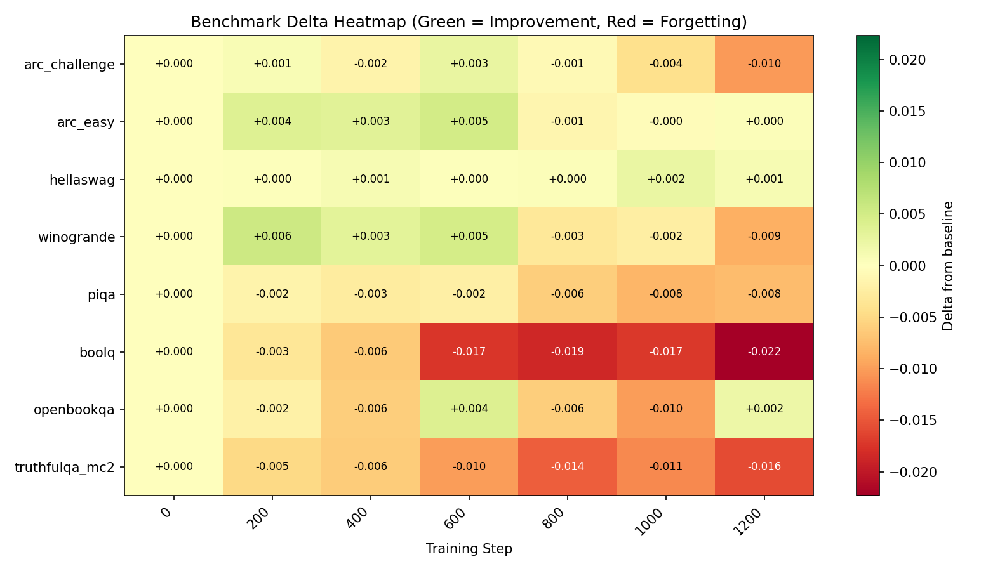

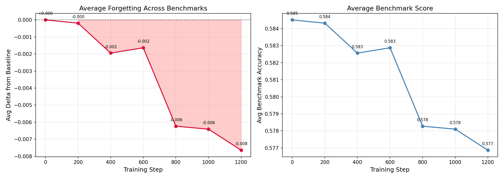

| Metric | Value |
|--------|-------|
| Avg forgetting (8 benchmarks) | **-0.0076** |
| Worst benchmark | BoolQ (-0.0223) |
| 2nd worst | TruthfulQA (-0.0157) |
| Task accuracy (step 1200) | 87.4% |

**10-benchmark results (partial: steps 0, 1000, 1200):**

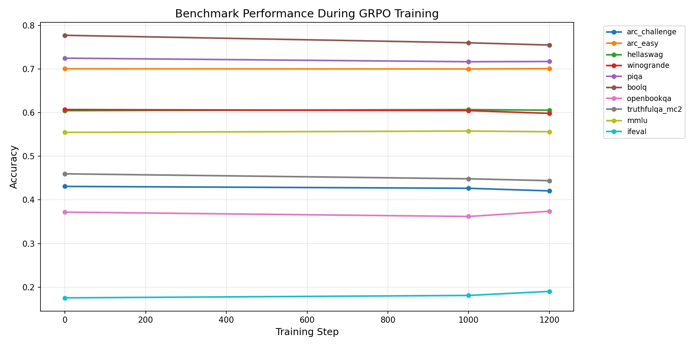

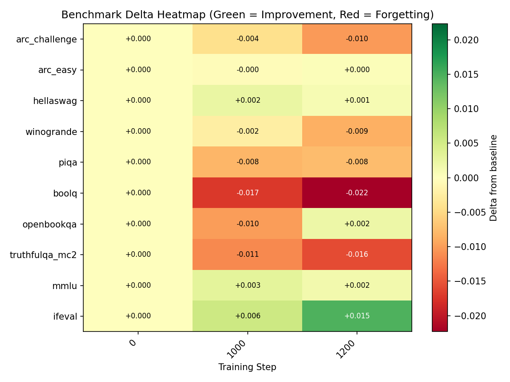

| Metric | Value |
|--------|-------|
| Avg forgetting (10 benchmarks) | **-0.0045** |
| MMLU | +0.0016 (no forgetting) |
| IFEval | +0.0148 (improved) |
| Worst benchmark | BoolQ (-0.0223) |

### GT-SFT GSM8K — Forgetting (8 benchmarks, steps 0–1000)

> GT-SFT on GSM8K ground truth shows **no forgetting** — consistent improvement across the board.

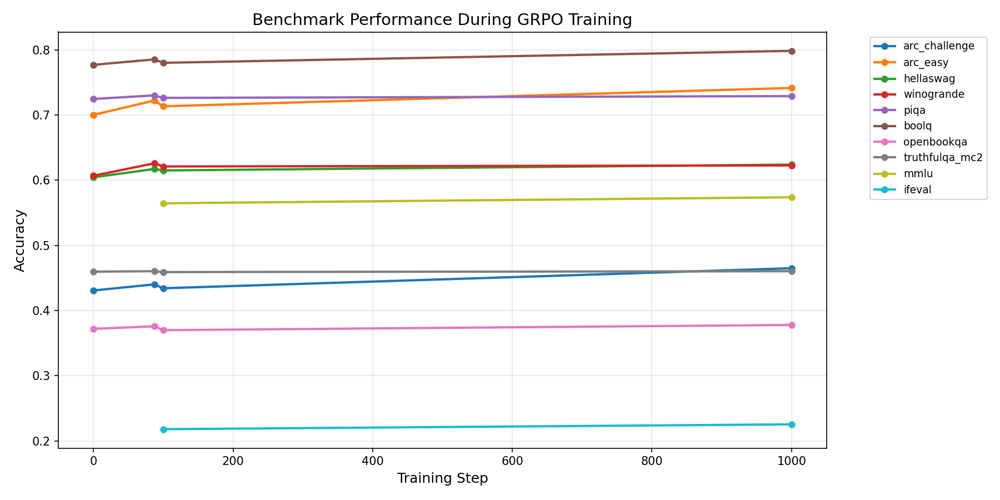

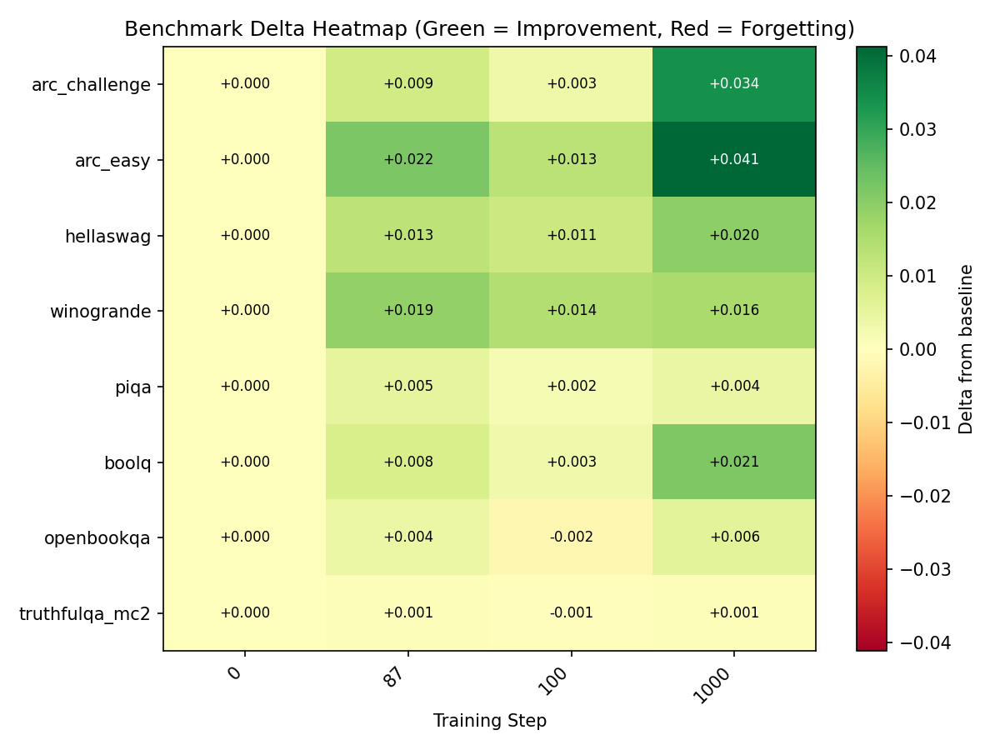

| Benchmark | Base | Step 1000 | Delta |
|-----------|------|-----------|-------|
| arc_challenge | 0.4309 | 0.4650 | **+0.0341** |
| arc_easy | 0.7003 | 0.7416 | **+0.0412** |
| hellaswag | 0.6045 | 0.6240 | **+0.0195** |
| winogrande | 0.6069 | 0.6227 | **+0.0158** |
| piqa | 0.7247 | 0.7291 | **+0.0044** |
| boolq | 0.7771 | 0.7985 | **+0.0214** |
| openbookqa | 0.3720 | 0.3780 | **+0.0060** |
| truthfulqa_mc2 | 0.4597 | 0.4605 | **+0.0007** |
| **Average** | | | **+0.0179** |

*15-checkpoint eval with 10 benchmarks in progress (4/16 done).*

### GT-SFT MATH — Forgetting (10 benchmarks, steps 0–1000)

> GT-SFT on MATH shows **no forgetting** — improvement on 9/10 benchmarks. Only IFEval drops.

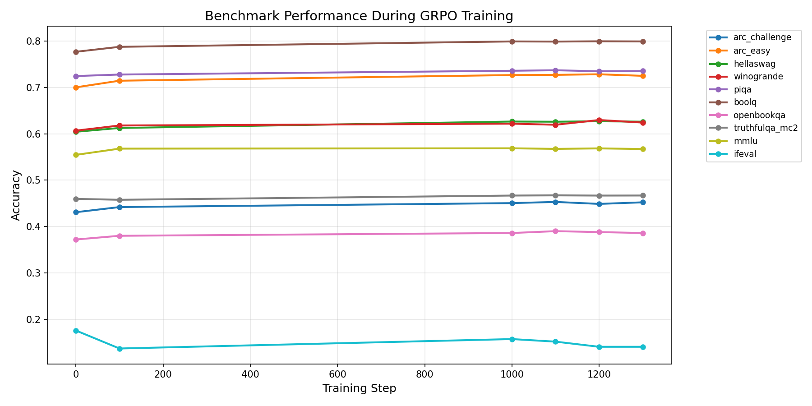

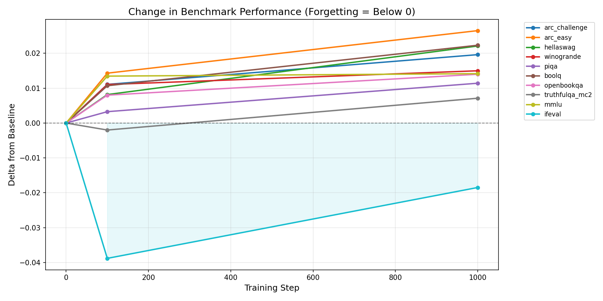

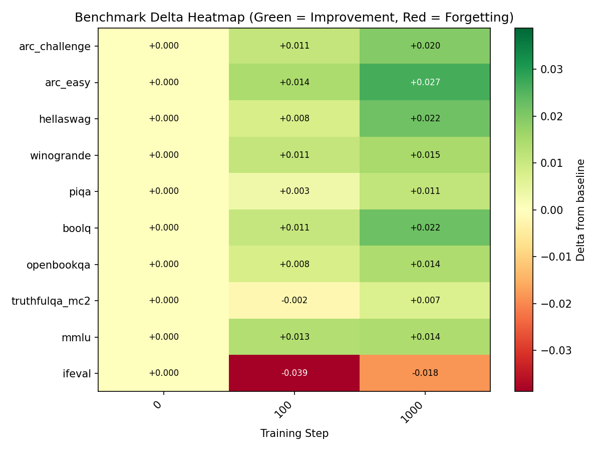

| Benchmark | Base | Step 100 | Step 1000 | Delta (1000) |
|-----------|------|----------|-----------|-------------|
| arc_challenge | 0.4309 | 0.4420 | 0.4505 | **+0.0196** |
| arc_easy | 0.7003 | 0.7146 | 0.7269 | **+0.0265** |
| hellaswag | 0.6045 | 0.6126 | 0.6266 | **+0.0221** |
| winogrande | 0.6069 | 0.6180 | 0.6219 | **+0.0150** |
| piqa | 0.7247 | 0.7280 | 0.7361 | **+0.0114** |
| boolq | 0.7771 | 0.7878 | 0.7994 | **+0.0223** |
| openbookqa | 0.3720 | 0.3800 | 0.3860 | **+0.0140** |
| truthfulqa_mc2 | 0.4597 | 0.4577 | 0.4668 | **+0.0071** |
| mmlu | 0.5546 | 0.5681 | 0.5688 | **+0.0142** |
| ifeval | 0.1756 | 0.1368 | 0.1571 | **-0.0185** |
| **Average** | | | | **+0.0134** |

*12 more checkpoints evaluating (job 8864513 on L40S).*

### Comparison: GRPO vs GT-SFT (GSM8K + MATH)

Three methods compared: GRPO on GSM8K, GT-SFT on GSM8K, GT-SFT on MATH.

#### Benchmark Accuracy (absolute scores per step)


#### Forgetting (delta from baseline)


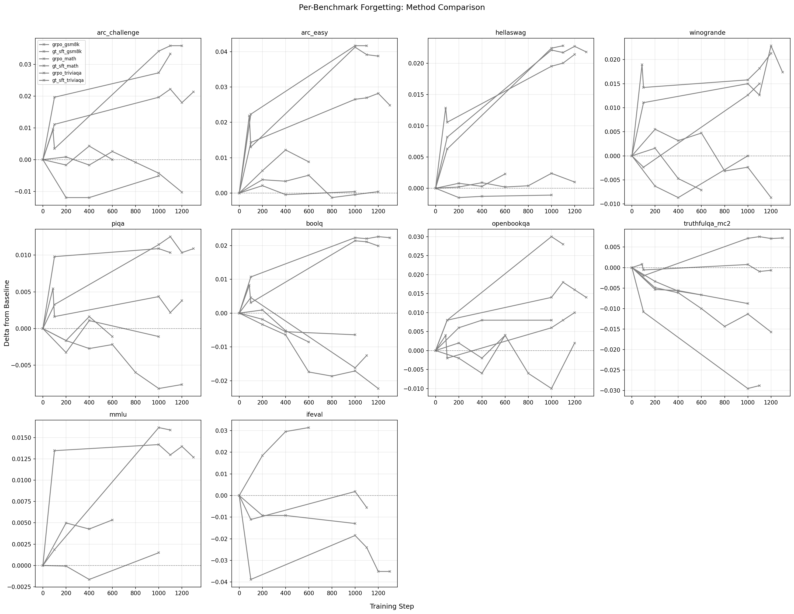


#### Cross-Dataset Summary

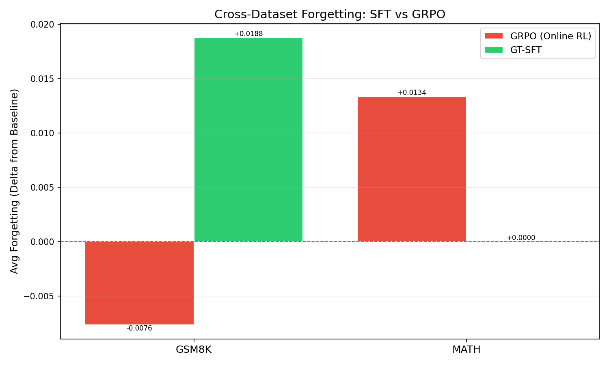

#### Task Accuracy (In-Distribution)


| Method | Dataset | Base | Best Step | Best Acc | Trend |
|--------|---------|------|-----------|----------|-------|
| GRPO | GSM8K | 59.0% | 600 | **87.0%** | +28pp, huge gain |
| GT-SFT | GSM8K | 59.0% | 87 | 56.6% | -4pp, drops and stays low |
| GRPO | MATH | — | — | — | Eval pending |
| GT-SFT | MATH | — | — | — | Eval pending |

**Key findings:**
- **GT-SFT improves OOD benchmarks** — scores go UP on both GSM8K (+0.019 avg) and MATH (+0.013 avg). No forgetting.
- **GRPO degrades OOD benchmarks** — mild forgetting on GSM8K (-0.008 avg), worst on BoolQ (-0.022) and TruthfulQA (-0.016)
- **GRPO dramatically improves task accuracy** (59% → 87% on GSM8K), while **GT-SFT drops task accuracy** (59% → 55%)
- The GT-SFT task accuracy drop is likely a **generation format mismatch**: base model uses `<think>` reasoning mode which SFT training disrupts
- GT-SFT on MATH shows same pattern as GSM8K: OOD benchmarks improve, IFEval is the only one that drops
- **The training method, not the data, drives forgetting**: same GSM8K data, opposite forgetting outcomes

---

## Data Inventory

All data in `~/scratch/forgetting-llms/data/`.

| Directory | Format | Samples | Source | Ready |
|-----------|--------|---------|--------|-------|
| `gsm8k/` | GRPO | 7,473 | openai/gsm8k | Yes |
| `gsm8k_sft/` | SFT | 7,473 | openai/gsm8k (reformatted) | Yes |
| `gsm8k_sf_sft/` | SFT | 6,946 | Qwen3-32B teacher (93% pass) | Yes |
| `math/` | GRPO | 7,397 | EleutherAI/hendrycks_math | Yes |
| `math_sft/` | SFT | 7,397 | EleutherAI/hendrycks_math | Yes |
| `math_sf_sft/` | SFT | 3,151 | Qwen3-32B teacher (43% pass) | Yes |
| `triviaqa/` | GRPO | 7,500 | mandarjoshi/trivia_qa | Yes |
| `triviaqa_sft/` | SFT | 7,500 | mandarjoshi/trivia_qa | Yes |
| `triviaqa_sf_sft/` | SFT | 6,568 | Qwen3-32B teacher (88% pass) | Yes |

---

## Cluster Notes

- **QOS limit (main)**: cpu=8, gpu=2, mem=48G per user — max 2 concurrent eval jobs
- **L40S validated**: Smoke test passed (CUDA, transformers, vLLM, lm_eval). 46GB VRAM, compute 8.9, batch_size=1 for evals
- **Eval speed**: ~1.5h per checkpoint (10 benchmarks, batch_size=1, 1x A100 or L40S)
- **Task accuracy eval**: ~20-30 min per experiment (all checkpoints, vLLM generation + grading)
- **Trajectory gen**: MATH ~6.5h, TriviaQA ~1.7h, GSM8K ~3.5h (Qwen3-32B, TP=2)
- **SFT training**: ~2-3h for 3 epochs (~1400 steps), 2x A100
- **GRPO training**: ~4-8h for 15 epochs, 2x A100
- Jobs chained via `--dependency=afterany` to stay within QOS
- All new eval jobs use L40S (`--gres=gpu:l40s:1 --cpus-per-task=4`)

---

## TODO

- [ ] Finish 4 remaining eval sweeps (GT-SFT MATH, GRPO MATH, GT-SFT TriviaQA, GRPO TriviaQA) — running on L40S
- [ ] Finish 4 remaining task accuracy evals — queued, chained after sweeps
- [x] Validate L40S GPUs for eval pipeline
- [ ] Investigate GT-SFT task accuracy drop (59% → 55%) — likely `<think>` mode disruption
- [ ] Submit SF-SFT training (3 datasets) — data ready
- [ ] Submit SF-SFT eval sweeps (3 runs)
- [ ] Regenerate comparison plots with all 6 experiments complete
- [ ] Start Phase 2: Qwen3-4B (repeat all experiments)
- [ ] CF-SFT: need Llama-3.1-70B trajectories
- [ ] SELF/SPIN: needs implementation
- [ ] PI: needs implementation

### SF-SFT Launch Commands (ready to run)

```bash
# Training (chain after eval sweeps finish to stay within QOS)
sbatch scripts/run_sft.sh gsm8k Qwen/Qwen3-1.7B sf_sft_qwen3_1.7b_gsm8k sf
sbatch scripts/run_sft.sh math Qwen/Qwen3-1.7B sf_sft_qwen3_1.7b_math sf
sbatch scripts/run_sft.sh triviaqa Qwen/Qwen3-1.7B sf_sft_qwen3_1.7b_triviaqa sf

# Eval sweeps (chain after training)
sbatch scripts/eval_sweep_resumable.sh ~/scratch/forgetting-llms/checkpoints/sf_sft_qwen3_1.7b_gsm8k sf_sft_qwen3_1.7b_gsm8k
sbatch scripts/eval_sweep_resumable.sh ~/scratch/forgetting-llms/checkpoints/sf_sft_qwen3_1.7b_math sf_sft_qwen3_1.7b_math
sbatch scripts/eval_sweep_resumable.sh ~/scratch/forgetting-llms/checkpoints/sf_sft_qwen3_1.7b_triviaqa sf_sft_qwen3_1.7b_triviaqa
```
